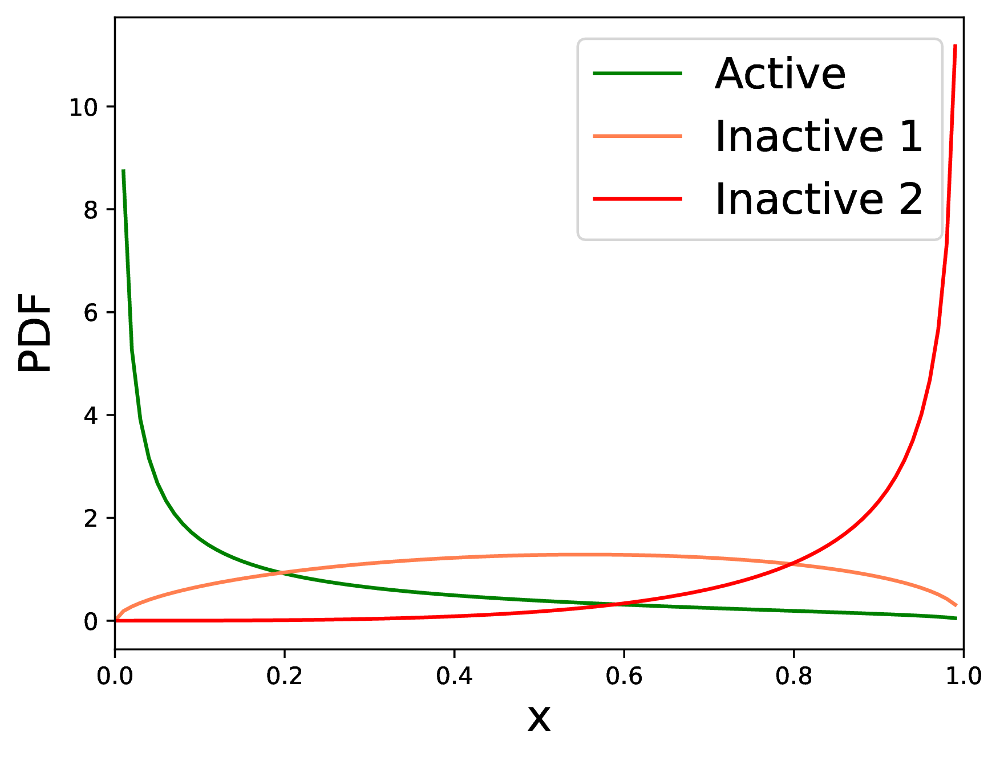
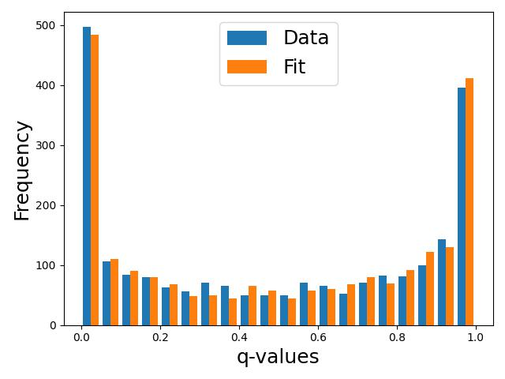
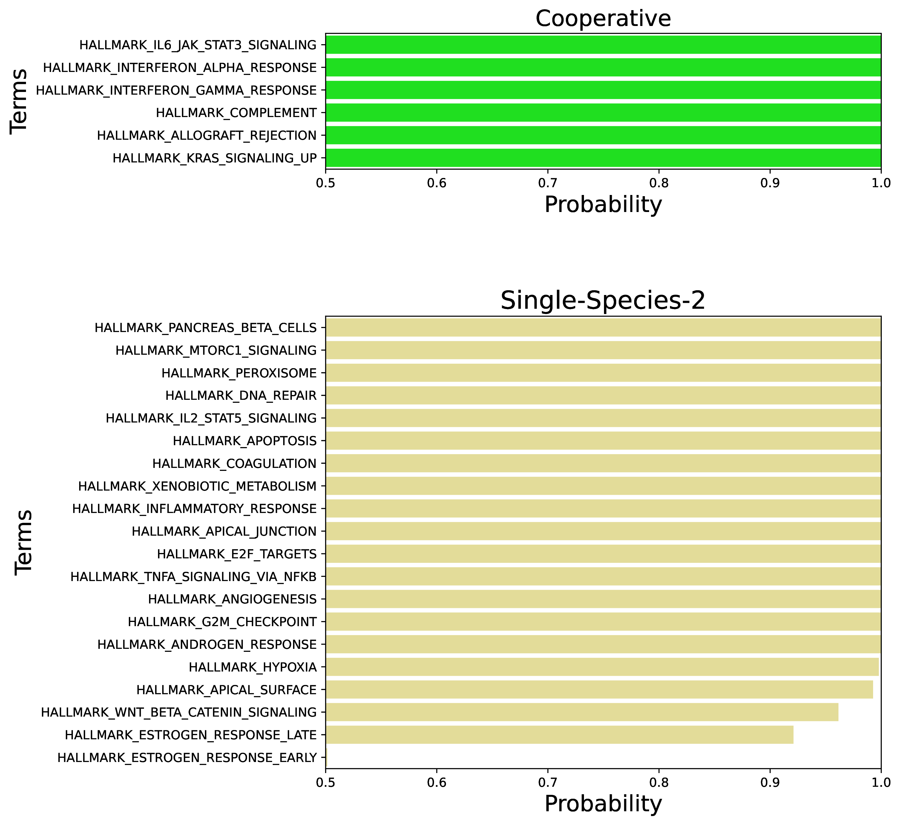
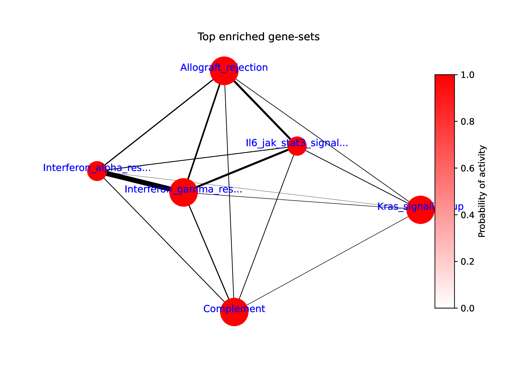
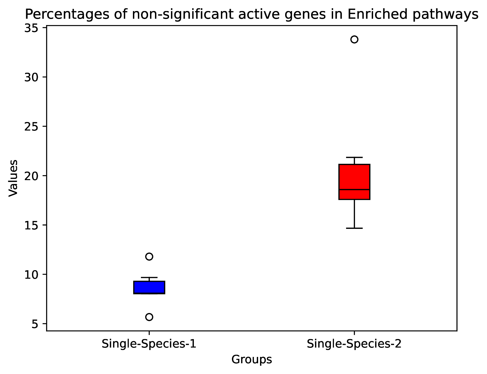
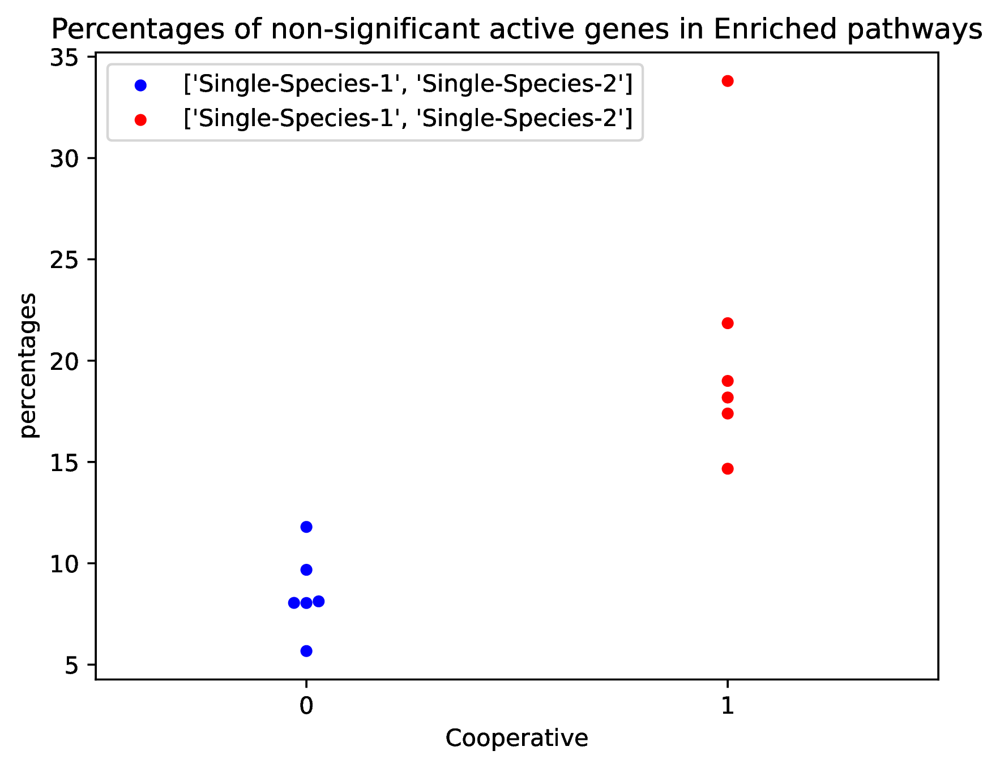

# Results

JOANA works in two steps

in first step it parametize signifance scores of Differentially Expresion Analysis with a Beta Mixture Model (BMM). In the second step it infer probability of pathway activity with a Bayesian Network.

## Results for Step I

JOANA provides a plot which shows how BMM fits to the results of DEA (each omics type seperatly).

It also provide a barplot which indicates goodness of fit to the obsereved data

## Results for Step II

### barplots for probabilitis of pathway activity
joana provide a pdf file which contain barplots that shows enriched pathways with probailities more than 0.5 for multi-omics (cooperative) data and pathways for each single-omics modality more with probability >=0.5 and doesn't show up in multi-omics

It also shows a graph with indicate how pathways are related to each other (egdes thinkness shows how much pathways are interconnected (i.e. pathways have common genes) and the sixe of nodes shows the size of pathways)

it also provides box-plot and beeswarm-plot that shows percentage of insignificant active genes (hidden-active) gene in the enriched results 

